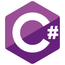
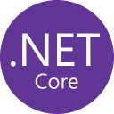

# Igo Ferreira Pinheiro :man_technologist:

<!--
**igoPinheiro/igoPinheiro** is a ✨ _special_ ✨ repository because its `README.md` (this file) appears on your GitHub profile.

Here are some ideas to get you started:

- 🔭 I’m currently working on ...
- 🌱 I’m currently learning ...
- 👯 I’m looking to collaborate on ...
- 🤔 I’m looking for help with ...
- 💬 Ask me about ...
- 📫 How to reach me: ...
- 😄 Pronouns: ...
- ⚡ Fun fact: ...
-->

### Hello people!  Welcome to my profile :octocat:

- 🎓 Bachelor's Degree in Computer Science. [Fucapi](https://fucapi.edu.br/)
- 🔭 I'm a .Net developer
- ⚡ I´m currently working with .Net for desktop and web software development
- 🌱 I’m currently learning Dart and 💙 Flutter
- 🌱 I’m currently learning DevOps
- 💬 Objective: Work in the area of information technology, with analysis and / or systems development.

<h3 align="left">Languages and Tools:</h3>

 
    
    
       
    
       
    
    
    
    
    
 

